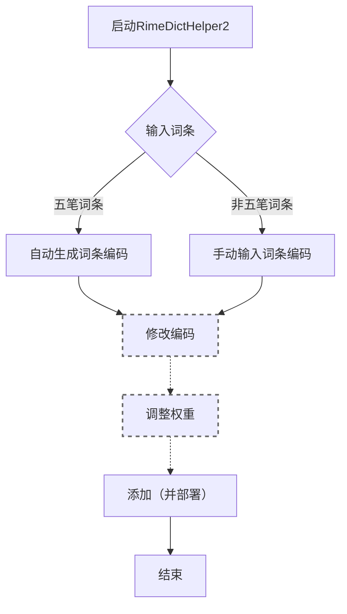
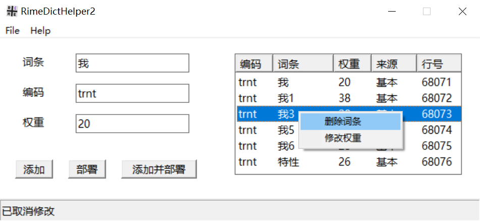
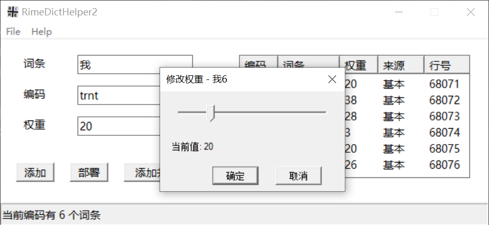

# RimeDictHelper2

用于管理Rime输入法词库的小工具。功能简单，受众小众。主要自用，顺便分享，有缘人遇到可按需自取。
[下载地址](https://github.com/Sh1kaCodAyo/RimeDictHelper2/releases)

## 1. 简介

如果你也：

+ 使用Windows平台
+ 使用Rime输入法

那么也许`RimeDictHelper2`对你会有帮助。如果你恰好还：

+ 使用五笔
+ 喜欢手动管理词库而抗拒自动造词
+ 使用Git管理自己的词库

那么这个小工具简直就是为你量身定制的了。

## 2. 基本功能

+ 图形化造词操作
+ 自动生成词组编码（基于五笔词组编码规则）
+ 重码检测及管理。遇到重码可以删除已有词条，也可调整其权重

<figure>


[//]: # (<figcaption >软件主界面</figcaption>)
</figure>

## 3. 附加功能

+ 后置自定义脚本。最基本地，可以在里面调用`WeaselDeployer.exe`实现自动部署

+ 我平时使用Git管理词库，所以还会在里面添加git相关命令

  <small>因为本质上只是调用一个本地脚本，脚本内容完全由您自定义，就和您的Rime输入法一样自由。</small>

## 4. 程序目录结构

```bash
RimeDictHelper2
 ├─after.bat  # 可选
 ├─config.ini
 └─RimeDictHelper2.exe
```

## 5. 配置方法

按上述目录结构部署好应用即可。

### 5.1. config.ini

`config.ini`文件中需要配置如下内容：

```ini
[Settings]
# BaseDictPath为${Rime用户文件夹}\xxx.dict.yaml 
BaseDictPath = D:\ProgramData\rime\wubi86_jidian.dict.yaml
# UserDictPath为${Rime用户文件夹}\xxx_user.dict.yaml
UserDictPath = D:\ProgramData\rime\wubi86_jidian_user.dict.yaml
```

其中`BaseDictPath`用于读取单字编码，以便后续自动生成词组编码。


`UserDictPath`则是用户词典，本工具的本质就是自动在这个文件尾部追加内容。

### 5.2. after.bat

`after.bat`为可选项。建议至少添加如下内容：

```bat
rem 前半部分替换为自己Rime的安装目录即可。
rem 也可在“开始菜单-小狼毫输入法-【小狼毫】重新部署”快捷方式的属性窗口，将“目标”一栏的内容直接复制到下面
"D:\Program Files\Rime\weasel-0.17.4\WeaselDeployer.exe" /deploy
```

这样每次添加后就免去手动重新部署，可立即生效。

## 6. 使用方法&碎碎念


输入词条 → （确认编码） → （确认权重） → 确认添加，就这么简单。如果稍微详细点说：


### 6.1. 添加
点击“添加”按钮，即将当前词条、编码、权重，拼接后追加到`UserDictPath`尾部。

### 6.2. 部署
点击“部署”按钮，将执行`after.bat`。默认进行Rime重新部署操作，使词库改动生效。
可以修改此文件以自定义后置动作。

### 6.3. 添加并部署
点击“添加并部署”相当于依次点击“添加”、“部署”。回车键也会触发“添加并部署”。

### 6.4. 自动编码和重码管理
程序会根据`config.ini`中配置的词库路径读取原有词库。输入词条后，以基本词库中读取到的单字编码为基础数据、根据五笔词组编码规则，可以自动生成词组的编码，并且查询原有词库（暂未支持扩展词库）中是否有词条与新生成的编码重复。如果有，将在右侧列表中展示。

如果出现重码，可以置之不理，也可以对其进行管理。右键点击已有词条，可以选择删除词条或修改权重，如下图所示：

<figure>


[//]: # (<figcaption >删除词条</figcaption>)
</figure>
<figure>


[//]: # (<figcaption >调整权重</figcaption>)
</figure>

*注意：重码管理和“添加”按钮本质上都是对本地配置的词库文件进行修改，不会立即生效。想要生效仍需点击“部署”按钮。*

*另外，根据上述编码原理也可得知，如果你的基本词库中有单个特殊字符也有编码，那么它们完全可以像普通单字一样参与生成编码，比如➕(+的emoji，假定其在基本词库中的编码为`lkkg`)，可以基于此，生成“➕➕”一词的编码`lklk`*

### 6.5. 其他
作为一个轻量级小工具，我的习惯是通过Windows快捷方式设定全局快捷键，以便遇到词库词条缺失时，随时调出使用。

其实从Rime词库的原理上讲，本工具并不针对具体输入模式。但因为我本身是五笔用户，所以针对五笔输入法做了更多适配，包括但不限于：

+ 输入词组后会按照五笔词组编码规则自动生成编码。可以手动修改，本意是可以自定义特殊符号如emoji➕的编码
+ 编码一栏最大长度限定为4码
  + 可在`config.ini`中通过修改`MaxCodeLength`的值来调整此限制
+ 词条最大长度为10。其实五笔输入法很少会有那么长的词，大多还是2~4字。但拼音输入法我不太确定

总之脑补对拼音用户不是非常友好，不过也许也能用。

[//]: # (目前还有些相关功能想要补充进去，无奈本人C++苦手，所以只能慢慢添加。)

## 7. 更新记录

### 2026-08-17

增加功能：输入词条后按`Ctrl + Enter`可实现“添加并部署”完成后自动关闭窗口（若只按`Enter`则仅为“添加并部署”，不会自动关闭窗口）

### 2026-08-16

增加功能：自动生成编码、重码检测及管理

### 2026-08-09

完成基本功能：本地词库追加词条、执行后置脚本自动部署及自定义动作

## 8. 致谢
> 开发基于Rime输入法词库管理方案
> 
> 图标设计使用`Source Code Pro`字体（Adobe出品，SIL开源字体许可证1.1)

[//]: # (> Icon designed using Source Code Pro font &#40;Adobe, SIL OFL 1.1&#41;)
