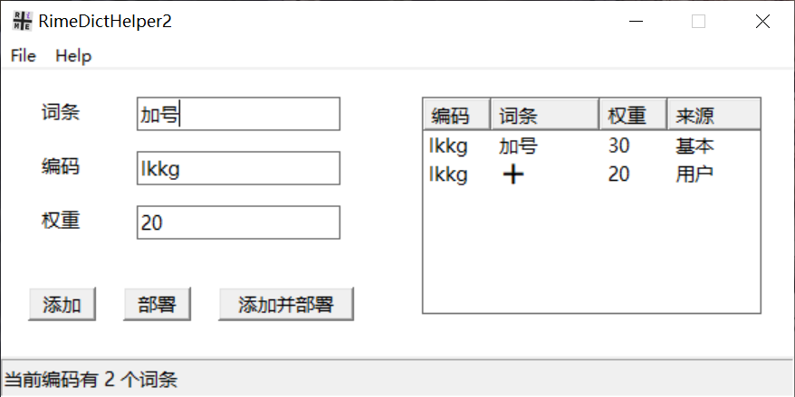

# RimeDictHelper2

用于管理Rime输入法词库的小工具。功能简单，受众小众。主要自用，顺便分享，有缘人遇到可按需自取。

## 1. 简介

如果你也：

+ 使用Windows平台
+ 使用Rime输入法

那么也许`RimeDictHelper2`对你会有帮助。如果你恰好还：

+ 使用五笔
+ 喜欢手动管理词库而抗拒自动造词
+ 使用Git管理自己的词库

那么这个小工具简直就是为你量身定制的了。

## 2. 基本功能

+ 图形化造词操作
+ 自动生成词组编码（基于五笔词组编码规则）
+ 重码检测

<figure>

<figcaption >软件主界面</figcaption>
</figure>

## 3. 附加功能

+ 后置自定义脚本。最基本地，可以在里面调用`WeaselDeployer.exe`实现自动部署

+ 我平时使用Git管理词库，所以还会在里面添加git相关命令

  <small>因为本质上只是调用一个本地脚本，脚本内容完全由您自定义，就和您的Rime输入法一样自由。</small>

## 4. 程序目录结构

```bash
RimeDictHelper2
 ├─after.bat  # 可选
 ├─config.ini
 └─RimeDictHelper2.exe
```

## 5. 配置方法

按上述目录结构部署好应用即可。

### 5.1. config.ini

`config.ini`文件中需要配置如下内容：

```ini
[Settings]
# BaseDictPath为${Rime用户文件夹}\xxx.dict.yaml 
BaseDictPath = D:\ProgramData\rime\wubi86_jidian.dict.yaml
# UserDictPath为${Rime用户文件夹}\xxx_user.dict.yaml
UserDictPath = D:\ProgramData\rime\wubi86_jidian_user.dict.yaml
```

其中`BaseDictPath`用于读取单字编码，以便后续自动生成词组编码。


`UserDictPath`则是用户词典，本工具的本质就是自动在这个文件尾部追加内容。

### 5.2. after.bat

`after.bat`为可选项。建议至少添加如下内容：

```bat
rem 前半部分替换为自己Rime的安装目录即可。
rem 也可在“开始菜单-小狼毫输入法-【小狼毫】重新部署”快捷方式的属性窗口，将“目标”一栏的内容直接复制到下面
"D:\Program Files\Rime\weasel-0.17.4\WeaselDeployer.exe" /deploy
```

这样每次添加后就免去手动重新部署，可立即生效。

## 6. 使用方法&碎碎念

如果是五笔用户，直接输入新词后会自动生成编码，同时会查询该编码是否存在重码，若有会在右侧列表中显示。后续计划加入重码管理功能。

### 6.1. 添加
点击“添加”按钮，即将当前词条、编码、权重，拼接后追加到`UserDictPath`尾部。

### 6.2. 部署
点击“部署”按钮，将执行`after.bat`。默认进行Rime重新部署操作，使词库改动生效。
可以修改此文件以自定义后置动作。

### 6.3. 添加并部署
点击“添加并部署”相当于依次点击“添加”、“部署”。回车键也会触发“添加并部署”。

### 6.4. 其他
作为一个轻量级小工具，我的习惯是通过Windows快捷方式设定全局快捷键，以便遇到词库词条缺失时，随时调出使用。

其实从Rime词库的原理上讲，本工具并不针对具体输入模式。但因为我本身是五笔用户，所以针对五笔输入法做了更多适配，包括但不限于：

+ 输入词组后会按照五笔词组编码规则自动生成编码。可以手动修改，本意是可以自定义特殊符号如emoji➕的编码
+ 编码一栏最大长度限定为4码
  + 可在`config.ini`中通过修改`MaxCodeLength`的值来调整此限制
+ 词条最大长度为10。其实五笔输入法很少会有那么长的词，大多还是2~4字。但拼音输入法我不太确定

总之脑补对拼音用户不是非常友好，不过也许也能用。

目前还有些相关功能想要补充进去，无奈本人C++苦手，所以只能慢慢添加。

> Icon designed using Source Code Pro font (Adobe, SIL OFL 1.1)
